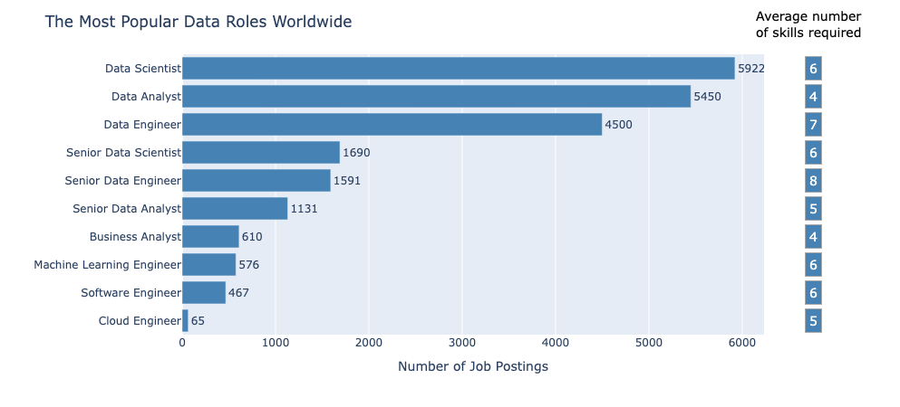
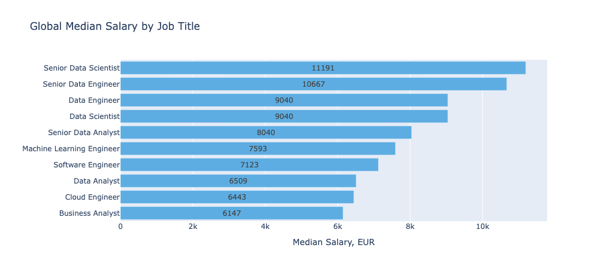
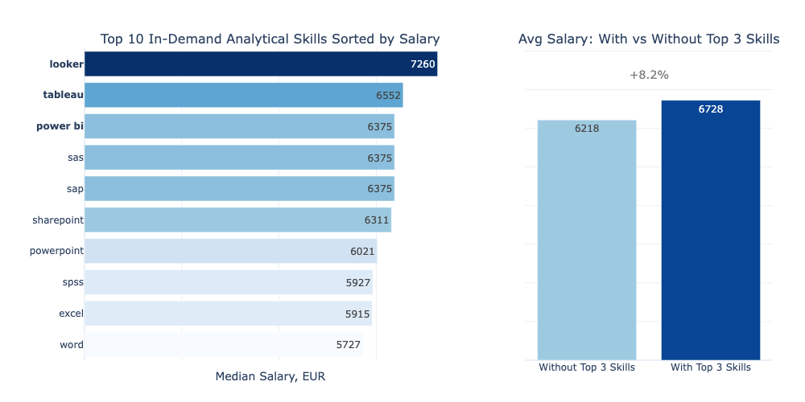

# Data Jobs Terzic Project

## Overview
This project explores **how to land a high-paying data job in Europe** using data-driven insights from global job postings.

I analyze data-related roles worldwide, with a focus on Europe, to identify the most in-demand positions, what they pay, and the factors that drive salary differences. The goal is to provide actionable, data-driven insights for anyone looking to grow their career in data, especially in the European market. 

## The Questions
1. Which data roles are the most accessible, and when is the best time to apply?
2. How well are top data roles paid in Europe, and which roles have future growth potential?
3. Which skills and job features have the biggest impact on salary?

## Tools I Used
To conduct a comprehensive analysis of the data analyst job market, I used a set of tools that supported data preparation, insightful exploration, and compelling visual storytelling:

- **Python & Libraries:**
    - **pandas, numpy:** for data cleaning and calculations.
    - **matplotlib, seaborn:** for static visualizations.
    - **plotly.express, plotly.graph_objects:** for building interactive dashboards and storytelling.
    - **xgboost, shap:** for interpretable ML to uncover salary insights.
    - **collections, ast, pathlib:** for efficient data grouping, parsing, and file handling.
- **Jupyter Notebooks:** my main workspace for combining code, visualizations, and commentary in one place.
- **Visual Studio Code:** used for editing and running Python scripts.
- **Git & GitHub:** for version control, project tracking, and public sharing.
- **AI Tools:** used to generate structured country data (EU + ISO codes), supported for debugging and brainstorming.
- **Grammarly:** used for clear, professional writing in documentation.
- **API connection:** used to convert salaries (USD → EUR) using live exchange rates for accurate regional analysis.

## Data Cleaning and Merging
This section covers the steps taken to prepare the raw datasets for analysis:

- Loaded the data_jobs dataset, real-time USD→EUR exchange rates, and a country dictionary.
- Merged the main dataset with the dictionaries.
- Cleaned the data: removed rows with missing or duplicated salary values, parsed string job_skills column into Python lists, converted date column to datetime format.
- Converted yearly salaries in USD to monthly salaries in EUR.
- Grouped jobs into EU, US, and Other.
- Saved the cleaned dataset as df_Final.csv for use across notebooks.

```python
df_Final.to_csv(raw_data_dir / 'df_Final.csv', index=False)
```

## Exploratory Data Analysis
This notebook is structured as follows:
- Dataset Overview
- Summary Statistics
- Visualizing Distributions
- Exploring Relationships

First, we'll import all libraries needed and load the cleaned Dataset:
```python
df = pd.read_csv(Path.cwd().parents[0] / 'Raw_Data' / 'df_Final.csv')
```
In the next notebooks, we'll use the same approach to connect the data.

### Dataset Overview
The dataset contains over 22,000 job postings across 21 columns, most of them are categorical, while numerical are salary values converted to EUR. 

There are no missing values in almost all core columns used for analysis, such as job title, salary, and country. However, the job_skills column has around 10% missing values. Since skill-related analysis is a key focus in the final section of this project, we will apply targeted filtering and visualization only on the subset where skills are available.

### Summary Statistics
Salary distributions show a wide range, with a **median monthly salary** of approximately **€8,137**, but also contain extreme outliers. We'll explore it deeply in the next section.

An initial scan shows that the top three **most popular data roles** are **Data Scientist**, **Data Analyst**, and **Data Engineer**. These roles stand out with significantly more job postings compared to others, making them the clear **focus for further analysis**.

### Vizualizing Distributions
#### Salary distribution


The salary distribution is right-skewed with significant outliers, suggesting a few exceptionally high-paying roles, which may reflect different job types or experience levels. 

Some countries, like Belarus and the Dominican Republic, report unusually high median salaries. Exploring the cases, we can see that they have very small sample sizes. Probably, job postings list a company’s legal registration address rather than the actual work location or listed salaries in local currencies. To correct this, **salary outliers will be removed** based on **job title** and **country**, and for countries with **fewer than 5 listings**, filtering will be done using **job title only**.

#### Binary variable distribution: Remote vs. In-office, and whether education is mentioned.
The majority of job postings do not mention **remote work** options (85%) or **degree requirements** (85%). This suggests that while the data industry is often seen as flexible and skills-driven, traditional expectations like on-site presence and formal education still dominate job descriptions. So, we’ll explore how **these factors affect salary** in the following sections.

### Exploring Relationships
To explore how **time affects salary and hiring trends**, we focus on the **Data Analyst** role and examine monthly changes in number of job postings and compensation.

- A negative correlation (-0.6) between `month` and `job_postings_count`, suggesting that job postings tend to decrease as the year progresses. This may reflect hiring cycles, and budget periods. A deeper analysis could help identify the **best time to apply**.

- A positive correlation (0.61) between `job_postings_count` and `median_salary`, indicating that more job openings are generally associated with higher salaries. Identifying these peak months can help job seekers **maximize their salary** potential when entering the job market.

We also examined how the **number of required skills** influences compensation:

- There's a clear positive relationship between the number of required skills and the median salary for Data Analyst roles, suggesting that having more relevant skills can positively impact salary.

- A notable salary spike occurs for postings with 20+ skills, exceeding €11,000/month, though this likely reflects a few high-paying outliers rather than a consistent pattern.

Overall, the data supports the idea that adding relevant skills can directly **boost earning potential** for data professionals.

### Summary
The exploratory data analysis showed that the dataset is generally well-structured, salary data shows high variability and right skewness, highligting the importance of carefully removing outliers in further analysis.

A clear seasonal pattern emerged: **job postings tend to decrease throughout the year**, while months with **more postings** are associated with **higher median salaries**. 

Additionally, roles requiring a **broader skill set** tend to offer **better compensation**, suggesting that technical versatility is valued in the data job market and can be a key driver of salary.

Next, we explore which roles are most in demand and how skill expectations differ.

## The Analysis
Here, we answer the three main questions outlined at the beginning of the readme, and the first is:

## Which data roles are the most accessible, and when is the best time to apply?
In this section uncovered:
- The most in-demand Data Roles worldwide and the number of skills required for each of them.
- Top-3 Data Roles in Europe, the United States, and other countries.
- Job posting trends for the Top-3 Data Roles.

### The most in-demand Data Roles worldwide and the number of skills required for each of them
A higher number of job postings and a lower number of skills required often means a lower barrier to entry the job. Let's look at the top data roles by popularity.



The most popular data roles, **Data Scientist**, **Data Analyst**, and **Data Engineer**, stand out with significantly more job postings compared to others. At the same time, the lower number of skills required for **Data Analysts** suggests it is a more accessible **entry point** into the data field, making it a practical **base role for further analysis**.

### Top-3 Data Roles in Europe, the United States, and other countries
Now, let’s break down job postings by location and explore which of the top three data roles is the most popular in **Europe**. By comparing it with trends in the **United States** — often the headliner of the global data job market — we can gain insight into **emerging demand patterns** and anticipate what roles are likely to grow across Europe in the near future.


In the EU, **Data Analysts** represent the largest share of the top three data roles, accounting for 37.7% of job postings, with **Data Scientists** close behind at 34.7%. This suggests that the EU market currently places a strong emphasis on data analysis and reporting as core business functions.

Conversely, in the US, **Data Scientists** lead slightly with 38.5%, followed by **Data Analysts** at 36.8%. This indicates that the US market is more focused on advanced analytics and machine learning applications, reflecting a more mature adoption of data science as a specialized and rapidly growing function.

Interestingly, in other countries, **Data Engineers** make up the largest share at 40.6%, highlighting a regional focus on building and maintaining data infrastructure.

For job seekers starting their data career in the EU, focusing on **Data Analyst** roles is a strong choice given their high demand and widespread presence in the job market. Meanwhile, the higher demand for **Data Scientists** in the US suggests that this field will continue to expand globally, offering excellent future career growth and opportunities.

### Job Posting Trends for the Top-3 Data Roles
Next, we explore the **monthly trends** for the top three data roles. This helps identify **when hiring peaks** throughout the year—key timing knowledge for job seekers aiming to land a role.


The number of job postings for **Data Analyst** and **Data Scientist** roles peaks in January, followed by a noticeable dip, then rises again between June and August. This pattern suggests a **stable hiring trend** aligned with the start of the financial year and mid-year budget reviews.

For job seekers, this implies that **January and July are strategic times to apply**.

### Summary
Data Analyst, Data Scientist, and Data Engineer as the three most in-demand data roles in the global job market, while the **Data Analyst** is the most **popular in Europe**. The relatively lower skill count for Data Analysts suggests it is also a more **accessible entry point** into the data field, making it a practical **base role** for further analysis. 

Meanwhile, the higher demand for **Data Scientists** in the United States suggests that this field will continue to expand globally, offering future opportunities.

Hiring activity for these top roles peaks in **January** and **mid-summer** (June–August), aligning with annual and mid-year planning cycles — valuable timing insight for job seekers.

## How well are top data roles paid in Europe, and which roles have future growth potential?
This section analyzes salary trends for the most in-demand data roles, with a focus on European market, and includes:
- Global salary distribution across data roles.
- Salary distributions for Top-3 Data Roles in Europe.
- Salary gap for top-3 data roles between Europe and the United States.
- An interactive map visualizing median salaries for these roles across European countries.

First, as identified in the EDA section, we need to **remove salary outliers**:
- Outliers were removed per **job title** and **country** to preserve meaningful comparisons. 
- For countries with **fewer than 5 postings**, outliers were removed based on **job title only** to avoid skewed insights from limited data. 

After removing outliers, the dataset size decreased from 22003 to 21307 rows, which is 3% less.

### Global Salary Distribution
Analysing median salaries globally for each job title  highlights the earning potential and relative positioning of the most popular data roles worldwide.



Despite being the most popular role in Europe, **Data Analyst** has the **lowest median salary** among the top-3 data roles, indicating high accessibility but limited earning potential in the long term. In contrast, **Data Scientists** and **Data Engineers** both offer significantly higher median salaries (nearly 40% more), reflecting the increasing demand for advanced technical and analytical skills. 

For job seekers, starting as a **Data Analyst** offers a practical entry point, but upskilling toward **Data Science** — currently one of the highest-paid and fastest-growing roles globally — provides stronger long-term career and salary growth potential.

### Salary Distributions for Top-3 Data Roles in Europe
For the next steps, filter the dataset by only the top-3 in-demand roles and European countries.


**Data Scientists** and **Data Engineers** in Europe earn noticeably more than **Data Analysts**, reinforcing the global trend of higher compensation for more specialized roles. However, **Data Analyst** salaries have a narrow, predictable distribution, making them attractive for entry-level professionals seeking **stability and lower risk**. In contrast, the broader and skewed distributions for **Data Scientist** and **Data Engineer** roles indicate greater variability but also higher earning potential. 

### Salary gap for top-3 data roles between Europe and the United States
The **salary gap** between the US and EU is almost negligible for **Data Analysts** (1%), indicating this role is **well-established and globally standardized** in terms of expectations and compensation. However, the much larger gap for Data Engineers (19.3%) and especially Data Scientists (20.7%) suggests that the EU is still catching up in adopting advanced analytics and scaling data infrastructure. For job seekers in Europe, this implies **significant growth potential**, especially in **Data Science**, both in demand and compensation.

### An interactive map visualizing median salaries for these roles across European countries
This is an additional section that shows salaries by European countries for the top 3 in-demand roles - you can just explore for your interest.

### Summary
The salary analysis shows a clear trend: while **Data Analyst** roles are the most **in-demand** in Europe, they offer the **lowest earning potential** among the top three data roles. In contrast, Data Scientist and Data Engineer positions offer significantly higher salaries, but with much greater variability. It means that the salaries are influenced by multiple factors, including expertise in advanced tools, without that, professionals may earn salaries closer to — or even below — those of Data Analysts.

The small salary gap for **Data Analysts** between the United States and Europe suggests this role is **globally standardized**, whereas the larger gaps for Data Scientist and Data Engineer roles highlight untapped potential in the European market.

Given these insights, our next step will focus on **analyzing the key features** that influence **Data Analyst salaries**, to uncover what skills and factors can help job seekers maximize their earnings within this role.

## How can a Data Analyst Maximize Salary When Searching for a Job?
In this chapter, we'll uncover factors that influence the salary range for Data Analysts and will specify:
- Must-have skills for Data Analysts and how they affect salary.
- Top-paying analytical skills and their impact on salary.
- Impact of job type (remote vs on-site) and degree requirements on salary.
- Key drivers of Data Analyst salaries (SHAP analysis).

Before starting the analysis:
- Remove salary outliers, as done in the previous chapter, to ensure data quality and consistency.
- Filter the dataset to include only **Data Analyst** roles posted in **Europe** and **the United States**. This allows us to provide both region-specific insights and a broader market perspective.

### Must-have skills for Data Analysts and how they affect salary
To identify essential analytical tools for data analysts, we:
- extract top-10 in-demand skills from job postings,
- evaluate which of these skills are associated with higher salaries. 

This analysis helps job seekers prioritize skill acquisition based on both demand and earning potential.



Tools like **Looker**, **Tableau**, and **Power BI** top the list, offering the highest salary within the top-10 in-demand skills. Notably, candidates with at least one of the top 3 tools command an 8.2% higher average salary compared to those without. This emphasizes the strategic value of learning high-demand BI tools — both for entering the job market and for accelerating salary growth.

### Top-paying analytical skills and their impact on salary
Job seekers can boost their salary by over 15% with top-3 highest-paid analyst skills that are **Splunk**, **Alteryx**, and **Looker**. Splunk leads the list but is a niche tool focused on IT and security, making it less common in typical analyst roles. Alteryx specializes in data preparation and automation, offering both high pay and broader relevance. Looker stands out as the most strategic choice—it's both well-paid and widely used in modern analytics teams.

### Impact of job type (remote vs on-site) and degree requirements on salary
**Remote roles** and **degree requirements** show only **modest salary differences**. Current trends in the data job market reveal a growing emphasis on skills over formal education and flexibility as a benefit rather than a pay driver. 

### Key drivers of Data Analyst salaries (SHAP analysis)
To identify which job attributes **most strongly influence salaries**, we apply **SHAP analysis on an XGBoost model** with monthly salary as a target variable and skills, remoute status and degree requirements as a features.


**Excel** with 15.7% impact is the strongest salary driver, likely reflects its use in senior finance, strategy, or operations roles. Meanwhile **Python** with 10.6% impact strongly associated with higher salaries, especially in roles involving automation, or machine learning. Both Excel and Python are worth to highlight in the CV.

### Summary
Job seekers aiming for a **Data Analyst** role should focus on learning one of the most in-demand tools, like **Looker**, **Tableau**, or **Power BI**. To boost their salary further, mastering a niche tool such as **Splunk** or **Alteryx** helps, with Looker being a strong choice due to its high demand and top-tier pay. 

Salary differences between **remote** and **in-office** roles generally even out, suggesting that compensation is driven more by skill and value delivered than work location. Notably, job postings that do not mention **degree requirements** are slightly associated with lower salaries, possibly reflecting more junior positions. 

SHAP analysis showed that **Excel** is still a **key skill** for Data Analysts — the most impactful on salary — while **Python** strongly correlates with higher pay. Highlighting both tools when applying, could improve chances of landing better-paying roles.

## Project Summary
The global data job market is currently dominated by three key roles: **Data Analyst**, **Data Scientist**, and **Data Engineer**. In Europe, **Data Analyst** is the most in-demand position, and notably, it comes with the lowest skill barrier to entry. This makes it a smart **starting point** for job seekers looking to break into the data field.

Although Data Analyst roles offer lower average salaries compared to more technical roles, their compensation tends to be more consistent and predictable, making them appealing for those seeking stability. For this reason, the analysis focuses on the Data Analyst role and explores how job seekers can **optimize salary potential** during the application process.

An analysis of **22,002 global job postings collected throughout 2023** reveals clear trends in hiring patterns:

- **January and the summer months (June–August)** are the most active hiring periods.
    - There is a clear **correlation between job posting volume and salary**, suggesting that entering the market during peak demand can result in both faster hiring and better compensation.
- **Skill Demand = Higher Pay:** Data Analysts with more listed skills — especially in analytics tools — consistently earn more. 
    - **Looker**, **Tableau**, and **Power BI** are among the highest-paid and most commonly required tools. Knowing even one of them increases job chances and boosts salary up to 8% on average. 
    - Niche tools like **Splunk** and **Alteryx** can increase salaries by 15% or more.
    - **Excel** is still a **key skill** for Data Analysts — the most impactful on salary.
    - **Python** strongly correlates with higher pay.
- **Remote** roles showed only minor salary differences, and **education level** had a modest impact, highlighting that practical, in-demand skills are far more important in driving compensation.
- The salary gap between European and United States **Data Analyst** roles indicates a global alignment in compensation for this role, when the larger gap for **Data Scientist** highlight untapped **potential** in the European market.

**Conclusion**
For job seekers, starting as a **Data Analyst** offers an accessible and strategic entry point into the data industry. The role is in high demand, offers consistent pay, and allows for fast upskilling through tool specialization. Over time, expanding technical capabilities and transitioning toward **Data Science** roles can open up higher-paying and more specialized career paths.

## Next Steps
In future analysis, we’ll investigate how professionals can **transition from Data Analyst to Data Scientist**, as Data Scientist stands out with strong future potential — it’s the most in-demand role in the US, second in Europe, and offers the highest pay with room for salary growth in the EU. We'll explore skill development paths and salary growth projections.

**Thanks for reading — and feel free to ⭐ the project or leave feedback on GitHub if you found it helpful!**