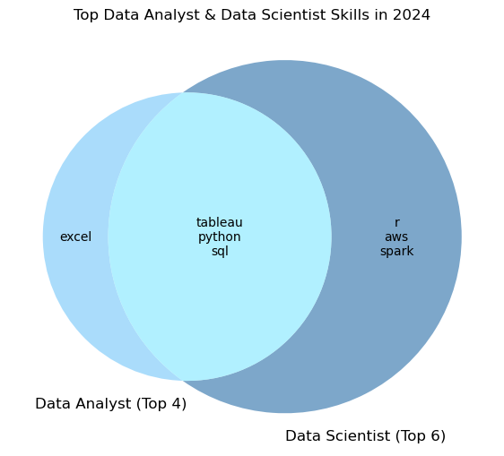

# Job Transition Terzic Project

## Overview
This project explores **how professionals can transition from Data Analyst to Data Scientist role**, as in the previos project we defined that **Data Analyst** is a smart **starting point** for job seekers looking to break into the data field, but it offers lower average salaries, so over time, transitioning toward **Data Science** roles can open up higher-paying and more specialized career paths.

Data Scientist stands out with strong future potential — it’s the most in-demand data role in the US, the second in Europe, and offers the highest pay with room for salary growth in the EU. In this project we'll explore skill development paths and salary growth projections.

## The Questions
1. What Skills Do You Need to Transition from Data Analyst to Data Scientist?
2. What salary could get a candidate after transition?

## Tools I Used
To conduct a comprehensive analysis of the data analyst job market, I used a set of tools that supported data preparation, insightful exploration, and visualising storytelling:

- **Python & Libraries:**
    - **pandas:** for data cleaning and transformations.
    - **matplotlib, seaborn:** static visualizations for salary distributions and skill trends.
    - **matplotlib-venn:** visualizing overlapping skills between roles.
    - **scikit-learn:** train/test splitting, baseline modeling.
    - **xgboost:** regression modeling for salary prediction.
    - **shap:** model interpretability and skill importance analysis.
    - **pathlib:** for efficient data grouping, parsing, and file handling.
- **Jupyter Notebooks:** my main workspace for combining code, visualizations, and commentary in one place.
- **Visual Studio Code:** used for editing and running Python scripts.
- **Git & GitHub:** for version control, project tracking, and public sharing.
- **AI Tools:** used to generate structured country data (EU + ISO codes), supported for debugging and brainstorming.
- **API connection:** used to convert salaries (USD -> EUR) using live exchange rates for accurate regional analysis.

## Data Cleaning and Merging

This section walks through the data loading and transformation process to prepare the dataset for analysis. Key steps include:

- Load multiple yearly datasets from CSVs.
- Clean the job postings dataset.
- Integrate exchange rate data to convert salaries to EUR.
- Merge country metadata for regional classification.
- Export the cleaned dataset for further exploration.

## Exploratory Data Analysis
In this section, I explore the structure and trends within the dataset, focusing on salary patterns and skill requirements for data-related roles:

- Dataset Overview
- Summary Statistics
- Analysing Salary Destributions
- Exploring Relationships (Skills vs. Salary)

**Key findings:**
- **Salary Gap:** Data Scientists **earn ~40% more** than Data Analysts, and 15% more than even **Senior Data Analyst**, suggesting a clear compensation advantage and growth opportunity. Data Scientist salaries also spanning a wider range, that reflects higher specialization and demand for advanced skills.
- **Skills Matter:** More required skills correlate with **higher pay**.
- **High-Paying Employers:** certain companies, such as AVIV Group (Germany) and Palta (Cyprus), offer salaries significantly above market medians.
- **Geographic Insights:** Top salaries are geographically diverse, though Germany has a notable concentration of high-paying employers.

Implication for career transitions:
For **Data Analysts** aiming to move into **Data Science**, upskilling in specific technical areas is a practical route to achieving higher salaries and accessing premium employers.

## The Analysis

## What Skills Do You Need to Transition from Data Analyst to Data Scientist?

This section explores the skills needed to transition roles using 2023-2024 global job postings. It will cover:

- The average number of skills required for Data Analyst and Data Scientist roles.
- Gap analysis comparing the skill sets of Data Analysts and Data Scientists.
- The most impactful skills on salary within these roles.

**Key findings:**
- On average, Data Scientists require about **6 skills** per job posting, while Data Analysts require about **4**.
- Excel, fundamental for Data Analysts, is less important for Data Scientists, so no need develop this skill when you are looking for the transition.
- The common top skills for Data Analysts and Data Scientists are **SQL, Python and Tableau**. These skills are also the most impactful on salary. 
- To transition successfully, Data Analysts should close the skill gap with Data Scientist requirements:

- Focus on learning **R, Spark, and AWS** that'll help to sucseed Data Scientist role requirement.

Also take into account that you don't need focuse on Tableau if you as a Data Analyst aleady know Power BI or Looker as powerful data visualization tools. Moreover, optionaly you can choose SAS instead of R as statistical analysis tools, Azure instead of AWS as cloud platforms, Tensorflow or Pytorch instead of Spark that are more focuced ML and deeplearning than big data processing.

## What salary could get a candidate after transition?

To support data analysts transitioning to data science roles, I build a xgboost model to predict salary can get the candidate based on key skills we defined for transition. On this sectin:

- Engineer binary skill features.
- Train an XGBoost regression model.
- Predict the monthly salary in EUR.

**Key findings:**

An XGBoost model was trained on skill and job attributes to estimate salary for the candidate with defined in the previous section skills:
- **Base skills:** Python, SQL, Tableau or equal visualisation tool as Power BI or Looker.
- **Transition skills:** statistical: R or SAS, cloud: AWS or Azure, big data and machine learning: Spark, TensorFlow, or PyTorch.

for the full-time job in Europe:
- **Categorical variables:** full-time, is_eu.

Learning only 3 certain additional skills to a **Data Analyst** skillset the candidate can successfully transfer to **Data Scientist** role with even higher than median salary.

## Project Summary

**Data Scientists** earn about 40% more than **Data Analysts**, largely thanks to a broader and more advanced skillset. If the candidate is more technical and would like to stay hands-on projects, rather then go to people management, the smart next career step is strategic upskilling to Data Scientist role.

**Career Transition Path**
- Core Analyst toolkit is already mastered: `Python`, `SQL`, `Tableau` (or `Power BI` / `Looker`)
- High-value additions for transition:
    - Statistical tools: `R`, `SAS`.
    - Cloud platforms: `AWS`, `Azure`.
    - Advanced ML/Big Data: `Spark`, `TensorFlow`, `PyTorch`.

Data Scientists require about **6 skills** on average per job posting. By learning 3 additional skills to Data Analyst skill-set (1 from each group) the candidate can match most Data Scientist requirements.

Predictive modeling with XGBoost confirmed this pathway: a simulated Analyst who adds these skills can realistically reach a **Data Scientist salary above the market median** in Europe.

**Conclusion**
Upskilling strategically is the most effective way for a **Data Analyst** to unlock higher-paying opportunities. Focusing on languages like R or SAS, cloud platforms such as AWS/Azure, and big data/machine learning frameworks like Spark, TensorFlow or PyTorch provides the leverage to move into **Data Science** roles with strong salary growth potential.

**Thanks for reading — and feel free to ⭐ the project or leave feedback on GitHub if you found it helpful!**