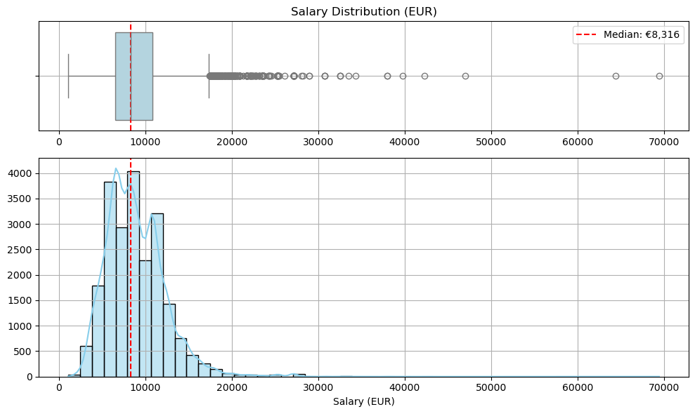
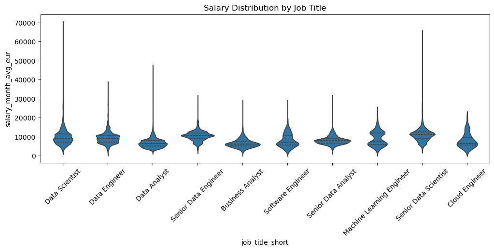
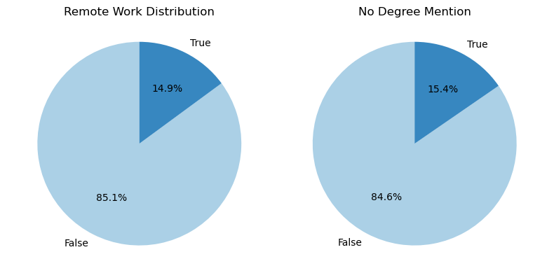
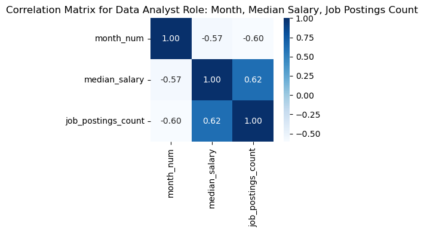
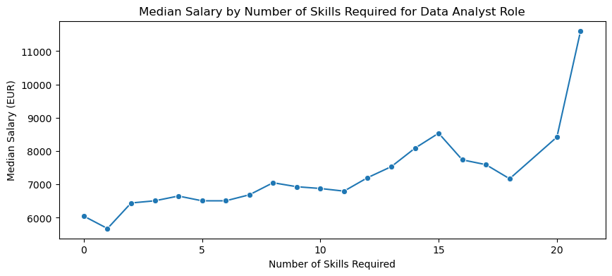

# Overview

Welcome to my unique Python project, where I analyze data job market, to answer one key question: "What should you do to land a high-paying data job in Europe?"

In this analysis, I explore data-related roles across the world and particulary in Europe, identifying the most in-demand positions, the key technologies you need to know, and the factors that influence salary levels. My goal is to provide data-driven insights for anyone aiming to grow their career in data — especially in the European market. 

# The Questions

1. Which data-related roles are the most popular in Europe and Worldwide?
2. What technologies should you learn to land one of the top 3 in-demand roles?
3. How well are the most popular roles paid in Europe?
4. How can a Data Analyst Maximize Salary When Searching for a Job?

# The Data
The main dataset sourced from [Luke Barousse's Python Course](https://lukebarousse.com/python) provides a foundation for my analysis, containing detailed information on job titles, salaries, locations, and essential skills. 

Additionaly I have used dictionary of European Union countries in csv format to separate EU region job postings for my analysis. 

I have also used API to load USD-EUR exchange rate from [Currency Exchange API]('https://open.er-api.com/v6/latest/USD') for calculating salaries in EUR.

# Tools I Used

For my deep dive into the data analyst job market, I harnessed the power of several key tools:

- **Python:** The core language behind my analysis — versatile and efficient for data manipulation and exploration. I worked with several key libraries:
    - **Pandas Library:** For reading, cleaning, and analyzing structured datasets.
    - **Matplotlib Library:** To create basic charts and visualize trends in the data.
    - **Seaborn Library:** For crafting more detailed and aesthetically pleasing visualizations.
- **Jupyter Notebooks:** My main workspace for combining code, visualizations, and commentary in one place, allowing for a clean and interactive workflow.
- **Visual Studio Code:** Used for editing and running Python scripts outside the notebook environment when needed.
- **Git & GitHub:** EUsed for version control and project sharing — helping track progress, collaborate, and store my code securely.
- **AI:** to generate a structured dictionary of EU countries with ISO codes, which was helpful in filtering and analyzing region-specific data.
- **[Currency Exchange API]('https://open.er-api.com/v6/latest/USD')** This API provides up-to-date exchange rates in JSON format. I used it to convert salaries from USD to EUR, ensuring the analysis is relevant and accurate for a European audience.

# Data Cleaning and Merging
To make the salary data more relevant for European users, I extended the main dataset (which includes yearly salaries in USD) with two additional sources:

- Exchange Rate — to convert salaries from USD to EUR.
- Country Dictionary — to group EU countries for regional analysis.
Since salaries in Europe are commonly discussed in monthly EUR, I calculated monthly equivalents for better local insight.

### Load Raw Data
- Import the job listings dataset from Hugging Face (lukebarousse/data_jobs).
- Load an up-to-date USD→EUR exchange rate from a public API.
- Load a custom country dictionary to identify EU member countries.

### Clean the Data
- Remove rows with missing yearly salary information.
- Convert job posting dates to datetime format.
- Parse the job skills from stringified lists to actual Python lists.

### Merge Datasets
- Merge in exchange rate data and convert salaries from USD to EUR.
- Add monthly salary calculation in EUR.
- Categorize each job into one of three regional groups: US, EU, or Other.

### Save Cleaned Dataset
The final cleaned dataset is saved as df_Final.csv for use in the next steps of the analysis.

# Exploratory Data Analysis (EDA)
This notebook explores the cleaned job listings dataset. The goal is to understand data structure, uncover distribution patterns, and analyze relationships between key features.

### Dataset Overview

- **Shape of the dataset:**
```python
df.shape

# Output: 
(22003, 21)
```

- Data types.
```python 
df.dtypes
```
#### Output:
job_title_short           object
job_title                 object
...
salary_month_avg_eur     float64
...
dtype: object

- Missing values.
```python
df.isna().sum()
```
#### Output:
job_title_short              0
job_title                    0
...
salary_month_avg_eur         0
...
dtype: int64

### Summary Statistics

- **Monthly salary (EUR)**: Basic descriptive statistics.
```python
df['salary_month_avg_eur'].describe().round(0).astype(int)
```
#### Output:
count    22003
mean      8916
std       3494
min       1085
25%       6508
50%       8316
75%      10848
max      69424
Name: salary_month_avg_eur, dtype: int64

- **Job title and country**: Count of postings.
```python
df['job_title_short'].value_counts().head(10)
```
#### Output:
job_title_short
Data Scientist               5922
Data Analyst                 5451
Data Engineer                4500
...
Name: count, dtype: int64

```python
df['job_country'].value_counts().head(10)
```
#### Output:
job_country
United States     15766
Sudan              1623
India               582
...
Name: count, dtype: int64

- **Median salary by country** (sorted descending): Some countries show unusually high values (e.g., Belarus, Dominican Republic, Northern Mariana Islands), likely due to a very small number of job postings.
```python
df.groupby('job_country')['salary_month_avg_eur'].median().sort_values(ascending=False).round(0).astype(int).head(10)
```
#### Output:
job_country
Belarus                     28927
...
Dominican Republic          11390
Northern Mariana Islands    11244
...
Name: salary_month_avg_eur, dtype: int64

> These outliers may represent the company’s legal registration address rather than the actual job location.

**Action Taken:**
- Remove outliers **per job title and country**.
- For countries with **fewer than 5 postings**, remove outliers **based on job title only**.

### Vizualizing Distributions
- Salary distribution for all data roles.



#### Insights:
The salary distribution is right-skewed with significant outliers, suggesting a few exceptionally high-paying roles, that may reflect different job types or experience levels. Median salary (~€8,300) is more representative than the mean, and future analysis should segment by role and carefully handling outliers.

- Salary distribution by job titles.


#### Insights:
Violin plots reveal significant salary variation across job titles. Senior roles consistently earn higher median salaries, particularly in engineering and science domains. Data Scientist roles show extreme outliers, indicating high variability and potential for such positions in specialized industries. Conversely, analyst roles tend to be more clustered, with moderate medians and narrower ranges. Machine Learning Engineers stand out for their strong and stable earning potential.

- Binary variable distribution: Remote vs. In-office, and whether education is mentioned.


#### Insights:
The majority of job postings do not mention remote work options (85%) or the absence of degree requirements (85%). This suggests that while the data industry is often seen as flexible and skills-driven, traditional expectations like on-site presence and formal education still dominate job descriptions. The relatively low share of remote or no-degree postings may reflect legacy HR practices or inconsistent job posting standards. These factors should be considered when analyzing job accessibility and inclusivity across roles.

### Exploring Relationships
- **Correlation Matrix for Data Analyst Role** reveals:


#### Insights:
  - A strong negative correlation between `month` and `job_postings_count`, suggesting that job postings tend to decrease as the year progresses. This may reflect hiring cycles, budget periods, or seasonal trends.
  - A positive correlation (0.62) between `job_postings_count` and `median_salary`, indicating that more job openings are generally associated with higher salaries.

- **Skills vs. Salary**:
  - Median Salary by Number of Skills Required for Data Analyst Role.

  
#### Insights:
Median salary increases with the number of skills required for the Data Analyst role.

### Data Quality Checks

- Identified and removed 1 duplicate row from the dataset.
```python
print(df.duplicated().sum())
```
#### Output:
1

The duplicate deleted in 0_Data_cleaning_and_merging notebook and df_Final.csv rewrited.
```python
df = df.drop_duplicates()
```