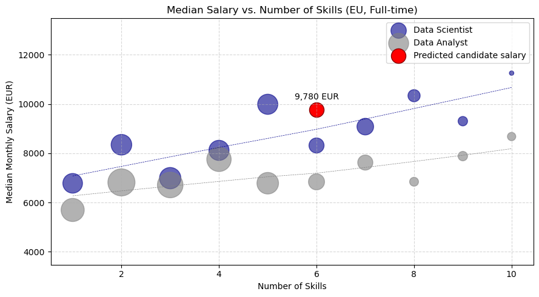

# Job Skills Terzic Project

This project consists of two parts: 
- **Data Jobs** Project explores **how to land a high-paying data job in Europe** using data-driven insights from global job postings. 
- While **Job Transition** Project uncovers **ways to boost the career and raise the salary** throught transition into more skilled and payed role.

## The Data
The main dataset sourced from [Data Jobs by Luke Barousse](https://lukebarousse.com/python) provides a foundation for my analysis, containing detailed information on job titles, salaries, locations, and essential skills. 

Additionally, I have used a dictionary of European Union countries in CSV format to separate EU region job postings for my analysis. 

I have also used the API to load USD-EUR exchange rate from [Currency Exchange API]('https://api.frankfurter.app/{date_str}?from=USD&to=EUR') for calculating salaries in EUR.

## Data Jobs Terzic Project

I analyze data-related roles worldwide, with a focus on Europe, to identify the most in-demand positions, what they pay, and the factors that drive salary differences. The goal is to provide actionable, data-driven insights for anyone looking to grow their career in data, especially in the European market. 

### The Questions
1. Which data roles are the most accessible, and when is the best time to apply?
2. How well are top data roles paid in Europe, and which roles have future growth potential?
3. Which skills and job features have the biggest impact on salary?

### Key findings:
The global data job market is currently dominated by three key roles: **Data Analyst**, **Data Scientist**, and **Data Engineer**. In Europe, **Data Analyst** is the most in-demand position, and notably, it comes with the lowest skill barrier to entry. This makes it a smart **starting point** for job seekers looking to break into the data field.

At the same time, Data Analyst roles offer lower average salaries compared to more technical roles. For this reason, the analysis explores how job seekers can **optimize salary potential** during the application process:

- **Timing matters:** January and June–August are the most active hiring periods. There is a clear correlation between job posting volume and salary, suggesting that entering the market during peak demand can result in both faster hiring and better compensation.
- **Skills in highest demand:**
    - `Looker`, `Tableau`, and `Power BI` are among the highest-paid from top-10 most commonly required tools. Knowing even one of them increases job chances and boosts salary by up to 8% on average.
- **Skills that boost salary most:** 
    - SHAP analysis showed that `Excel` is still a key skill for Data Analysts — the most impactful on salary.
    - `Python` and `SQL` strongly correlates with higher pay, making them the 'mast have' for landing the job.
    - Niche tools like `Splunk` and `Alteryx` are not in the hight demand, but they can further increase salaries by 15% or more.
- **Global pay comparison:** The salary gap between European and United States **Data Analyst** roles is relatively small, suggesting global alignment for this role. By contrast, the larger pay gap for **Data Scientist** positions highlights untapped potential in the European market.

**Conclusion**
For job seekers, starting as a **Data Analyst** offers an accessible and strategic entry point into the data industry. The role is in high demand, offers consistent pay, and allows for fast upskilling through tool specialization. Over time, expanding technical capabilities and transitioning toward **Data Science** roles can open up higher-paying and more specialized career paths.

### Next Step:
In future analysis, we’ll investigate how professionals can **transition from Data Analyst to Data Scientist**, exploring skill development paths and salary growth projections.

## Job Transition Terzic Project

This project explores **how professionals can transition from Data Analyst to Data Scientist**, as Data Scientist stands out with strong future potential — it’s the most in-demand role in the US, second in Europe, and offers the highest pay with room for salary growth in the EU.

### The Questions
1. What Skills Do You Need to Transition from Data Analyst to Data Scientist?
2. What salary could get a candidate after transition?

### Key findings:
- **Salary Advantage for Data Scientists**
    - Data Scientists earn ~40% more than Data Analysts, with salaries spanning a wider range. 
- **Skills Drive Salary Growth**
    - Job postings requiring more skills tend to offer higher salaries.
    - Core skills like Python, SQL, and Tableau/Power BI/Looker are shared across roles and are also the most influential in salary predictions.
    - Transition-critical knowlege includes cloud (AWS/Azure), statistical (R/SAS), and advanced ML tools (Spark/TensorFlow/PyTorch).
- **Career Transition Path**
    - Data Analysts typically need 4 skills, while Data Scientists list 6.
    - By adding just three high-value skills (e.g., R/SAS, AWS/Azure and Spark/TensorFlow/PyTorch) to an existing Analyst skillset, candidates can meet most Data Scientist requirements.
- **Predictive Modeling Insights**
    - An XGBoost model was trained on skill and job attributes to estimate salaries.
    - Candidate simulation showed that a transitioning Data Analyst, with the right upskilling, could realistically secure a Data Scientist salary above market median.

# Project Summary

For job seekers, starting as a **Data Analyst** offers an accessible and strategic entry point into the data industry. Over time, expanding technical capabilities and transitioning toward **Data Science** roles can open up higher-paying and more specialized career paths. 

Focusing on languages like R or SAS, cloud platforms such as AWS/Azure, and machine learning frameworks like TensorFlow or PyTorch provides the leverage to move into **Data Science** roles with strong salary growth potential.

**Thanks for reading — and feel free to ⭐ the project or leave feedback on GitHub if you found it helpful!**