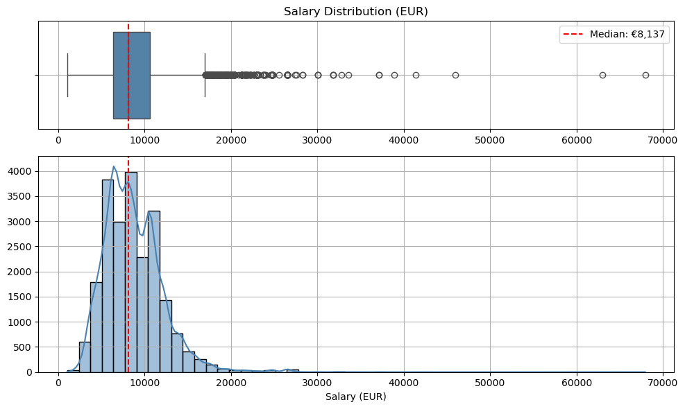

# Overview

Welcome to my unique Python project, where I analyze data job market, to answer one key question: "What should you do to land a high-paying data job in Europe?"

In this analysis, I explore data-related roles across the world and particulary in Europe, identifying the most in-demand positions, the key technologies you need to know, and the factors that influence salary levels. My goal is to provide data-driven insights for anyone aiming to grow their career in data — especially in the European market. 

# The Questions

1. Which data-related roles are the most popular in Europe and Worldwide?
2. What technologies should you learn to land one of the top 3 in-demand roles?
3. How well are the most popular roles paid in Europe?
4. How can a Data Analyst Maximize Salary When Searching for a Job?

# The Data
The main dataset sourced from [Luke Barousse's Python Course](https://lukebarousse.com/python) provides a foundation for my analysis, containing detailed information on job titles, salaries, locations, and essential skills. 

Additionaly I have used dictionary of European Union countries in csv format to separate EU region job postings for my analysis. 

I have also used API to load USD-EUR exchange rate from [Currency Exchange API]('https://open.er-api.com/v6/latest/USD') for calculating salaries in EUR.

# Tools I Used

For my deep dive into the data analyst job market, I harnessed the power of several key tools:

- **Python:** The core language behind my analysis — versatile and efficient for data manipulation and exploration. I worked with several key libraries:
    - **Pandas Library:** For reading, cleaning, and analyzing structured datasets.
    - **Matplotlib Library:** To create basic charts and visualize trends in the data.
    - **Seaborn Library:** For crafting more detailed and aesthetically pleasing visualizations.
- **Jupyter Notebooks:** My main workspace for combining code, visualizations, and commentary in one place, allowing for a clean and interactive workflow.
- **Visual Studio Code:** Used for editing and running Python scripts outside the notebook environment when needed.
- **Git & GitHub:** EUsed for version control and project sharing — helping track progress, collaborate, and store my code securely.
- **AI:** to generate a structured dictionary of EU countries with ISO codes, which was helpful in filtering and analyzing region-specific data.
- **[Currency Exchange API]('https://open.er-api.com/v6/latest/USD')** This API provides up-to-date exchange rates in JSON format. I used it to convert salaries from USD to EUR, ensuring the analysis is relevant and accurate for a European audience.

# Data Cleaning and Merging
- Load Raw Data
- Clean Data
- Merge Data
- Save Final Dataset

To make the salary data more relevant for European users, I extended the main dataset (which includes yearly salaries in USD) with two additional sources:

- Exchange Rate — to convert salaries from USD to EUR.
- Country Dictionary — to group EU countries for regional analysis.
Since salaries in Europe are commonly discussed in monthly EUR, I calculated monthly equivalents for better local insight.

### Load Raw Data
- Import the job listings dataset from Hugging Face (lukebarousse/data_jobs).

```python
#%pip install datasets
from datasets import load_dataset
dataset = load_dataset('lukebarousse/data_jobs')
df = dataset['train'].to_pandas()

df.head(3)
```
- Load an up-to-date USD→EUR exchange rate from a public API and save it to dataframe. 

```python
def get_usd_to_eur_rate_from_erapi():
    url = 'https://open.er-api.com/v6/latest/USD'
    response = requests.get(url)
    data = response.json()
    return data['rates']['EUR'] if data.get('result') == 'success' and 'EUR' in data.get('rates', {}) else None

x_rate = get_usd_to_eur_rate_from_erapi()

df_ex_rate = pd.DataFrame([{'year': 2023, 'usd_to_eur': x_rate}]).round(4)
```

To save files and to connect to the data in the next notebookes we'll use a filepath:
```python
current_dir = Path.cwd()
project_dir = current_dir.parents[1]
raw_data_dir = project_dir / "Raw_Data"
df_ex_rate.to_csv(raw_data_dir / "ex_rate.csv", index=False)
```
- Load a custom country dictionary to identify EU member countries.

```python
df_EU = pd.read_csv(raw_data_dir / 'EU_Countries_dict.csv', delimiter=';')

df_EU.head(3)
```

### Clean the Data
- Remove rows with missing yearly salary information.
- Delete duplicates found on 1_EDA.
- Convert job posting dates to datetime format.
- Parse the job skills from stringified lists to actual Python lists.

```python
df = df.dropna(subset=['salary_year_avg'])
df = df.drop_duplicates()
df['job_posted_date'] = pd.to_datetime(df['job_posted_date'])
df['job_skills'] = df['job_skills'].apply(lambda x: ast.literal_eval(x) if pd.notna(x) else x)
```

### Merge Datasets
- Merge in exchange rate data and convert salaries from USD to EUR.
```python
df_Final = df.rename(columns={'salary_year_avg': 'salary_year_avg_usd'})
df_Final['year'] = pd.to_datetime(df_Final['job_posted_date']).dt.year
df_Final = df_Final.merge(df_ex_rate, how='left', on='year')
df_Final['salary_year_avg_eur'] = (df_Final['salary_year_avg_usd'] * df_Final['usd_to_eur']).round(2)
```
- Add monthly salary calculation in EUR.
```python
df_Final['salary_month_avg_eur'] = (df_Final['salary_year_avg_eur'] / 12).round(2)

df_Final.loc[1:3, ['job_title_short', 'usd_to_eur', 'salary_year_avg_usd', 'salary_year_avg_eur', 'salary_month_avg_eur']]
```
- Added is_eu and ISO columns.
```python
df_Final = df_Final.merge(df_EU, how='left', left_on='job_country', right_on='country')
pd.set_option('future.no_silent_downcasting', True)
df_Final['is_eu'] = df_Final['is_eu'].fillna(False).astype(bool)

df_Final.loc[1:10, ['job_title_short', 'job_country', 'is_eu', 'ISO']]
```

- Grouped job postings into broader region categories: listings from the United States were labeled as "US", those from countries within the European Union as "EU", and all other countries retain their original job_country values.
```python
#Add Country grouping column
def group_country(row):
    if row['job_country'] == 'United States':
        return 'US'
    elif row['is_eu'] == True:
        return 'EU'
    else:
        return row['job_country']
    
df_Final['region_group'] = df_Final.apply(group_country, axis=1)

df_Final.loc[1:10, ['region_group', 'job_country', 'salary_month_avg_eur']]
```

### Save Cleaned Dataset
The final cleaned dataset is saved as df_Final.csv for use in the next steps of the analysis.

```python
df_Final.drop(columns=['usd_to_eur', 'year', 'salary_year_avg_usd', 'salary_hour_avg'], inplace=True)
df_Final.to_csv(raw_data_dir / 'df_Final.csv', index=False)

df_Final.head(3)
```

# Exploratory Data Analysis (EDA)
This notebook explores the cleaned job listings dataset. The goal is to understand data structure, uncover distribution patterns, and analyze relationships between key features. 

The analysis is structured as follows:
- Dataset Overview
- Summary Statistics
- Vizualizing Distributions
- Exploring Relationships
- Data Quality Checks

First we'll import all libraries needed and connect to data using File path:
```python
import pandas as pd
import matplotlib.pyplot as plt
import seaborn as sns

from pathlib import Path
current_dir = Path.cwd()
project_dir = current_dir.parents[1]
raw_data_dir = project_dir / "Raw_Data"
df = pd.read_csv(raw_data_dir / 'df_Final.csv')
```
in the next notebooks will use the same approach to connect to the data.

### Dataset Overview

The dataset contains over 22,000 job listings across 21 columns, including job titles, locations, salary details, and work conditions. Most columns are categorical, while numedical are salary values in  monthly format converted to EUR.

There are no missing values in the core columns used for analysis, such as job title, salary, and employment type. However, some fields—like job_location and job_schedule_type have missing entries.

### Summary Statistics
An initial scan reveals that Data Scientist, Data Analyst, and Data Engineer are the most frequently posted roles, with the United Statesas and European Union the top job locations.

Salary distributions show a wide range, with a median monthly salary of approximately €8,316, but also contain extreme outliers. Some countries—like Belarus, Dominican Republic, and Northern Mariana Islands—report unusually high median salaries. Exploring the cases we can see that they have very small sample sizes. Probably, job postings list a company’s legal registration address rather than the actual work location or listed salaries in local curancies. To correct this, salary outliers will be removed based on job title and country, and for countries with fewer than 5 listings, filtering wiil be done using job title alone to preserve analytical validity.

### Vizualizing Distributions
#### Salary distribution for all data roles.



#### Insights:
The salary distribution is right-skewed with significant outliers, suggesting a few exceptionally high-paying roles, that may reflect different job types or experience levels. Median salary (~€8,300) is more representative than the mean, and future analysis should segment by role and carefully handling outliers.

#### Salary distribution by job titles.


#### Insights:
Violin plots reveal significant salary variation across job titles. Senior roles consistently earn higher median salaries, particularly in engineering and science domains. Data Scientist roles show extreme outliers, indicating high variability and potential for such positions in specialized industries. Conversely, analyst roles tend to be more clustered, with moderate medians and narrower ranges. Machine Learning Engineers stand out for their strong and stable earning potential.

#### Binary variable distribution: Remote vs. In-office, and whether education is mentioned.


#### Insights:
The majority of job postings do not mention remote work options (85%) or the absence of degree requirements (85%). This suggests that while the data industry is often seen as flexible and skills-driven, traditional expectations like on-site presence and formal education still dominate job descriptions. The relatively low share of remote or no-degree postings may reflect legacy HR practices or inconsistent job posting standards. These factors should be considered when analyzing job accessibility and inclusivity across roles.

### Exploring Relationships
#### Correlation Matrix for Data Analyst Role** reveals:


#### Insights:
  - A strong negative correlation (-0.6) between `month` and `job_postings_count`, suggesting that job postings tend to decrease as the year progresses. This may reflect hiring cycles, budget periods, or seasonal trends. A deeper analysis could help identify the best time of year to actively search for a job.

  - A positive correlation (0.62) between `job_postings_count` and `median_salary`, indicating that more job openings are generally associated with higher salaries. Identifying these peak months can help job seekers maximize their salary potential when entering the job market.

#### Median Salary by Number of Skills Required for Data Analyst Role.

  
#### Insights:
This chart reveals a clear positive relationship between the number of required skills and the median salary for Data Analyst roles. For job postings that list up to around 15 skills, there's a steady upward trend in compensation — suggesting that even incremental increases in skill requirements can positively impact salary. This could reflect employers valuing more well-rounded candidates with broader technical or domain expertise. While there is a sharp spike for postings with more than 20 required skills (median salary exceeding 11,000 EUR), this may be driven by a small number of listings and should be interpreted with caution.

#### Data Quality Checks

Identified and removed 1 duplicate row from the dataset.
```python
print(df.duplicated().sum())
```
#### Output:
0

#### Previous run:


### EDA Summary
The exploratory data analysis revealed that the dataset is generally well-structured, with no missing values in key analytical columns and only one duplicate, which was removed. Salary data shows high variability and right skewness, emphasizing the importance of outlier handling in further analysis.

A clear seasonal pattern emerged: job postings tend to decrease throughout the year, while months with more postings are associated with higher median salaries. 

Additionally, roles requiring a broader skill set tend to offer better compensation, suggesting that technical versatility is valued in the data job market and can be a key driver of salary.

# The Analysis

Here, we answer the four main questions outlined at the beginning of the readme and the first is:

## Which Data-Related Roles Are the Most Popular in Europe and Worldwide?

This section explores the demand for various data roles based on job posting frequency across different regions and includes the following analyses:

- Most Popular Data Roles worldwide
- Job Posting Trends for the Top 3 Data Roles  
- Top 3 Data Roles in the EU, US, and Other Countries  

### Most Popular Data Roles by Number of Postings

#### Insights:
The most popular data roles over the past year are Data Scientist (5,922 job postings), Data Analyst (4,450 postings), and Data Engineer (4,500 postings). These three roles clearly dominate the market, while the remaining seven roles collectively account for just over 6,000 postings.

The high demand for Data Scientists suggests that more companies are beginning to adopt advanced analytics and machine learning, making this role a relatively new but rapidly growing function in many organizational structures. In contrast, Data Analysts are already well-established across industries, often forming the backbone of day-to-day data operations.

Looking ahead, the demand for Data Engineers is also expected to grow steadily as organizations scale their data infrastructure to support increasingly complex analytical workloads.

### Job Posting Trends for the Top 3 Data Roles

#### Insights:
The number of job postings for Data Scientist and Data Analyst roles peaks in January, followed by a noticeable dip, then rises again between June and August. This pattern suggests a stable hiring trend aligned with the start of the financial year and mid-year budget reviews.

For job seekers, this implies that January and July are strategic times to apply, as demand nearly doubles compared to December (particularly for Data Analyst roles). These peaks reflect periods when companies are planning new initiatives or expanding their data teams after evaluating performance and resource needs.

### Top 3 Data Roles in the EU, US, and Other Countries

#### Insights:
In the EU, Data Analysts represent the largest share of the top three data roles, accounting for 37.7% of job postings, with Data Scientists close behind at 34.7%. This suggests that the EU market currently places a strong emphasis on data analysis and reporting as core business functions.

Conversely, in the US, Data Scientists lead slightly with 38.5%, followed by Data Analysts at 36.8%. This indicates that the US market is more focused on advanced analytics and machine learning applications, reflecting a more mature adoption of data science as a specialized and rapidly growing function.

Interestingly, in other countries, Data Engineers make up the largest share at 40.6%, highlighting a regional focus on building and maintaining data infrastructure. This could reflect growing data ecosystems where investment in robust pipelines and scalable architectures is a priority before advanced analytics take off.

For job seekers starting their data career in the EU, focusing on Data Analyst roles is a strong choice given their high demand and widespread presence in the job market. Meanwhile, the higher demand for Data Scientists in the US suggests that this field will continue to expand globally, offering excellent future career growth and opportunities.

#### Conclusions:
We highlighted Data Scientist, Data Analyst, and Data Engineer as the three most in-demand data roles globally, with notable regional differences in their prevalence. In farther analysis we will focus on Data Analyst and Data Scientist roles, given their strong demand in European job market and evolving career opportunities globally.

## What technologies should you learn to land one of the top 3 in-demand roles?
To better understand the skills and tools that employers prioritize, this section examines the most requested technologies and the number of skills expected for each of the top three data roles, that includes:
- Likelihood of Technologies Requested for Top-3 Data Roles
- Number of skills requested for each of Top-3 Data Roles

### Likelihood of Technologies Requested for Top-3 Data Roles
We start by extracting and cleaning the technology and skill data from the dataset, then merge it with job postings for the top 3 data roles. We count how often each technology appears per role, normalize these counts, and finally 

To plot likelyhood of the top 5 most requested technologies for each role, we start by extracting and cleaning the technology and skill data from the dataset:
```python
df_technology = df['job_type_skills'].dropna().drop_duplicates().apply(ast.literal_eval)
technology_dict = {}
for row in df_technology:
    for tech, skills in row.items():
        technology_dict.setdefault(tech, set()).update(skills)
df_technology = pd.DataFrame([(k, list(v)) for k,v in technology_dict.items()], columns=['technology', 'skills']).explode('skills')
```

Then filtered dataset for top 3 roles, merge and explode to associate each job skill with its technology:
```python
df_top = df[df['job_title_short'].isin(top_roles)]

df_dropna = df_top.dropna(subset=['job_skills']).copy()
df_dropna['job_skills'] = df_dropna['job_skills'].apply(ast.literal_eval)
df_exploded = df_dropna.explode('job_skills')

df_plot = df_exploded.merge(df_technology, left_on='job_skills', right_on='skills').copy()
```

And finaly calculate top 5 technologies per role and plot it:
```python
top_tech_list = []
for role in top_roles:
    counts = df_plot[df_plot['job_title_short'] == role]['technology'].value_counts(normalize=True).head(5).reset_index()
    counts.columns = ['technology', 'percentage']
    counts['job_title_short'] = role
    top_tech_list.append(counts)
df_top_tech = pd.concat(top_tech_list)
```
Plot with subplots: one horizontal bar chart per role


#### Insights:
For Data Analysts, analytical tools and programming skills are the most in-demand, each appearing in about 40% of job postings. This highlights the importance of mastering tools like Excel, SQL, and data visualization software alongside foundational programming skills for this role.

Data Scientists demand even stronger programming expertise, with 47% of postings requiring it, while all other skill categories remain below 20%. This reflects the advanced coding and algorithmic knowledge needed for machine learning and predictive modeling.

For Data Engineers, programming is also critical, requested in 37% of job postings, emphasizing their role in building and maintaining data pipelines.

### Number of skills requested for each of Top-3 Data Roles
To calculate number of skills per role we added skills_count column with calculated number of skills per job posting:
```python
def count_skills(skills_str):
    if pd.isna(skills_str) or skills_str.strip() == '':
        return 0
    return len([s for s in skills_str.split(',') if s.strip() != ''])

df_top = df_top.copy()
df_top['skills_count'] = df_top['job_skills'].apply(count_skills)
```
Then grouped the data by each job role and calculated the average number of skills required per role using the skills_count column. Finally we cleaned up the output by resetting the index, renaming columns for clarity, sorting by average skills descending, and rounding the averages to whole numbers for easier interpretation:

```python
avg_skills_per_role = (
    df_top.groupby('job_title_short')['skills_count']
    .mean()
    .reset_index()
    .rename(columns={'skills_count': 'avg_skills'})
    .sort_values(by='avg_skills', ascending=False)
)

avg_skills_per_role['avg_skills'] = avg_skills_per_role['avg_skills'].round(0).astype(int)

print(avg_skills_per_role)
```
#### Output:
```python
job_title_short  avg_skills
1   Data Engineer           7
2  Data Scientist           5
0    Data Analyst           4
```

#### Insights:
The relatively lower skill count for Data Analysts suggests it is a more accessible entry point into the data field, making it a practical base role for further analysis.

#### Conclusions:
According to the data, the most in-demand role in Europe is Data Analyst, which also offers the most accessible entry point among the top three in-demand data roles. Therefore, we will focus on the Data Analyst role in the next steps of our analysis, placing particular emphasis on exploring analytical tools as foundational technologies for entering the position and advancing toward higher salaries.

## How well are the most popular roles paid in Europe?
This section analyzes salary trends for the most in-demand data roles, with a focus on European markets and includes:
- Global Salary Distribution
- Salaries of Top-3 in-Demand Data Roles in Europe
- Salary Gap% for Top-3 Data Roles in US and EU
- Interactive Map - Median Salary for Top-3 Data Roles in EU

But first, as identified in EDA section, we need to remove salary outliers.
#### Remove Salary Outliers
Outliers were removed per job title and country to preserve meaningful comparisons. For countries with fewer than 5 postings, outliers were removed based on job title only to avoid skewed insights from limited data. For this first calculate global IQR:
```python
Q1_global = df['salary_month_avg_eur'].quantile(0.25)
Q3_global = df['salary_month_avg_eur'].quantile(0.75)
IQR_global = Q3_global - Q1_global
lower_bound_global = Q1_global - 1.5 * IQR_global
upper_bound_global = Q3_global + 1.5 * IQR_global
```
Than build list to collect filtered results:
```python
Qfiltered_groups = []
```

And finaly, iterate over groups and for countries with more than 5 job postings calculate IQRs insight Job Title and Countery while for contries with less than 5 job postings, remove outliers based on job title only:
```python
for (country, title), group in df.groupby(['job_country', 'job_title_short']):
    if len(group) >= 5:
        Q1 = group['salary_month_avg_eur'].quantile(0.25)
        Q3 = group['salary_month_avg_eur'].quantile(0.75)
        IQR = Q3 - Q1
        lower = Q1 - 1.5 * IQR
        upper = Q3 + 1.5 * IQR
    else:
        lower = lower_bound_global
        upper = upper_bound_global

    filtered = group[
        (group['salary_month_avg_eur'] >= lower) &
        (group['salary_month_avg_eur'] <= upper)
    ]
    filtered_groups.append(filtered)
```
After removing outliers the dataset size decreased from 22003 to 21307 rows that is 3% less.

### Global Salary Distribution

#### Insights:
Despite being the most popular role in Europe, Data Analyst has the lowest median salary among the top-3 data roles, indicating high accessibility but limited earning potential in the long term. In contrast, Data Scientist and Data Engineer both offer significantly higher median salaries (nearly 40% more), reflecting the increasing demand for advanced technical and analytical skills. For job seekers, starting as a Data Analyst offers a practical entry point, but upskilling toward Data Science — currently one of the highest-paid and fastest-growing roles globally — provides stronger long-term career and salary growth potential.

### Salaries of Top-3 in-Demand Data Roles in Europe
For the next steps filter the dataset by only top-3 in-demand roles and European countries:
```python
top_roles = ['Data Analyst', 'Data Scientist', 'Data Engineer']

df_eu_top = df_filtered[
    (df_filtered['job_title_short'].isin(top_roles)) &
    (df_filtered['region_group'] == 'EU')
]
```

#### Insights:
Just like on the global level, Data Scientists and Data Engineers in Europe earn noticeably more than Data Analysts, reinforcing the global trend of higher compensation for more specialized roles. However, Data Analyst salaries have a narrow, predictable distribution, making them attractive for entry-level professionals seeking stability and lower risk. In contrast, the broader and skewed distributions for Data Scientist and Data Engineer roles indicate greater variability but also higher earning potential — especially for those with advanced skills and niche expertise. This underscores a clear trade-off between predictability vs. upside when choosing a career path in data.

### Salary Gap% for Top-3 Data Roles in US and EU
The US data roles market is often a step ahead globally in adopting emerging technologies and job specializations. Therefore, comparing salaries between the US and EU can help predict future trends for the European market, offering insight into potential career growth, remote work advantages, and long-term salary expectations.

#### Insights:
The salary gap between the US and EU is almost negligible for Data Analysts (1%), indicating this role is well-established and globally standardized in terms of expectations and compensation. However, the much larger gap for Data Scientists (19.3%) and especially Data Engineers (20.7%) suggests that the EU is still catching up in adopting advanced analytics and scaling data infrastructure. For job seekers in Europe, this implies significant growth potential in Data Science and especially Data Engineering, both in demand and compensation.

### Interactive Map - Median Salary for Top-3 Data Roles in EU

#### Insights:
This is an additional interactive map showing salaries by European countries for the top 3 in-demand roles. The highest salaries are found in Cyprus, Sweden, and the Netherlands. Cyprus stands out due to favorable conditions for registering companies, making it a profitable location for business. Meanwhile, Sweden and the Netherlands host many global companies such as Spotify, Netflix, and H&M, which contributes to higher salary levels in these countries.

### Conclusions:
Our exploratory salary analysis shows a clear trend: while Data Analyst roles are the most in-demand in Europe, they offer the lowest earning potential among the top three data roles. In contrast, Data Scientist and Data Engineer positions offer significantly higher salaries — but with much greater variability. It means that the salaries are influenced by multiple factors, including expertise in advanced tools such as machine learning, without that, professionals may earn salaries closer to — or even below — those of Data Analysts.

The small salary gap for Data Analysts between the United States and Europe suggests this role is globally standardized, whereas the larger gaps for Data Scientist and Data Egineer roles highlight untapped potential in the European market. Countries like Sweden, the Netherlands, and Cyprus currently lead in compensation, pointing to geographic salary hotspots worth targeting.

Given these insights, our next step will focus on analyzing the key features that influence Data Analyst salaries, to uncover what skills and factors can help job seekers stand out and maximize their earnings within this role. In parallel, we’ll keep an eye on Data Science as a strategic career evolution — a role that not only pays more but is also expected to grow rapidly in scope and demand.

## How can a Data Analyst Maximize Salary When Searching for a Job?
In this chapter we'll uncover factors that influence salary range for Data Analysts and will specify:
- Must-Have Skills for Data Analysts and How They Affect Salary
- Top-Paying Analytical Skills and Their Impact on Salary
- Impact of Job Type (Remote vs On-site) and Degree Requirements on Salary
- SHAP Analysis – Key Drivers of Data Analyst Salaries

Before starting the analysis:
- Remove salary outliers, as done in the previous chapter, to ensure data quality and consistency.
- Filter the dataset to include only 'Data Analyst' roles posted in Europe and the United States. This allows us to provide both region-specific insights and a broader market perspective. While EU postings help us understand localized salary drivers, US data acts as a benchmark — highlighting emerging trends in skills, remote work, and education, and helping us identify global standards in the data job market.

### Must-Have Skills for Data Analysts and How They Affect Salary
This analysis highlights the top 10 in-demand analytical tools for Data Analysts, ranked by median salary:

#### Insights:
Tools like Looker, Tableau, and Power BI top the list, offering the highest salary premiums. Notably, candidates with at least one of the top 3 tools command an 8.2% higher average salary compared to those without. This emphasizes the strategic value of learning high-demand BI tools — both for entering the job market and for accelerating salary growth. For job seekers, gaining proficiency in these technologies is a practical and high-impact step toward becoming a competitive and well-compensated Data Analyst.


#### Insights:


#### Insights:


#### Insights:
While modern tools like Python increase salary, traditional tools like Excel still carry major weight — possibly due to their presence in senior business roles:

- **Excel** (13.1% impact): Surprisingly the most influential skill. Likely reflects its use in senior finance, strategy, or operations roles.
- **Python** (8.3%): Strongly associated with higher salaries, especially in roles involving automation, scripting, or machine learning.
- **Tableau** (4.6%): Valued for data visualization, though less impactful than core programming skills.
- **SQL** (4.4%): Essential across most roles; its moderate impact suggests it's a baseline skill rather than a differentiator.

**No Degree Mention** slightly associated with lower salaries (3.5%), possibly reflecting more inclusive or junior positions.

### Conclusion:

## Conclusions:
We analyzed the top 3 data roles — Data Analyst, Data Scientist, and Data Engineer. Data Analyst is the most popular in Europe and has the lowest entry barrier, so we focused our analysis on it, despite its lower salary. These roles are primarily in-office, so target companies in your country and apply during high-demand months (January, June–August) when hiring and salaries peak. Focus on mastering key analytical tools and programming languages used by analysts. 

In future analysis we’ll investigate how professionals can transition from Data Analyst to Data Scientist, as Data Scientist stands out with strong future potential — it’s the most in-demand role in the US, second in Europe, and offers the highest pay with room for salary growth in the EU. We'll explore skill development paths, and salary growth projections.

Thanks for reading — and feel free to ⭐ the project or leave feedback on GitHub if you found it helpful!